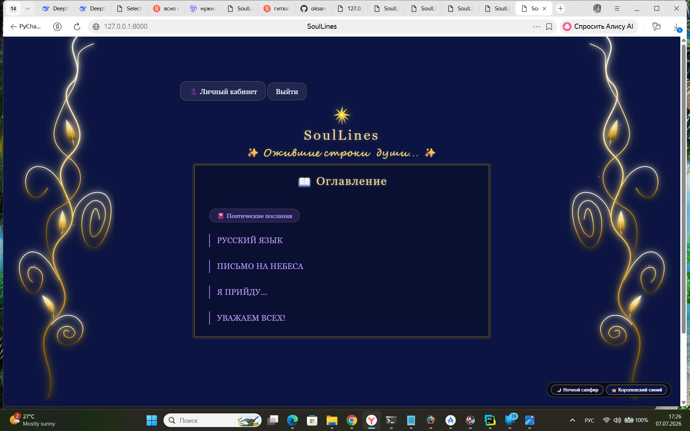
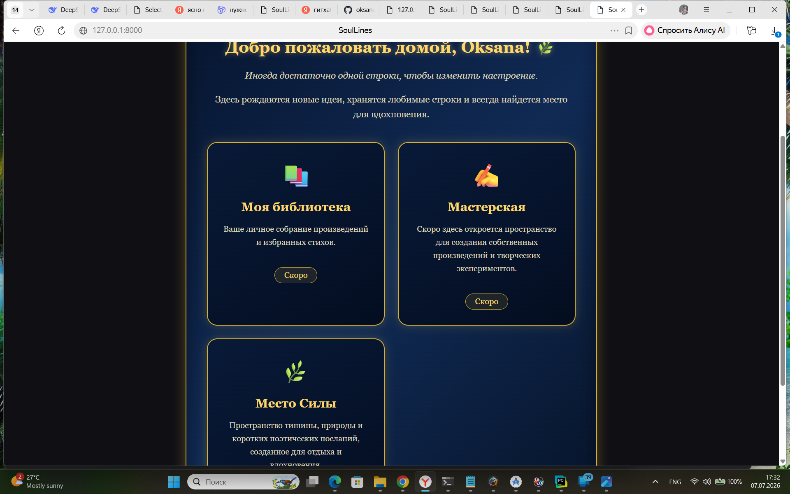
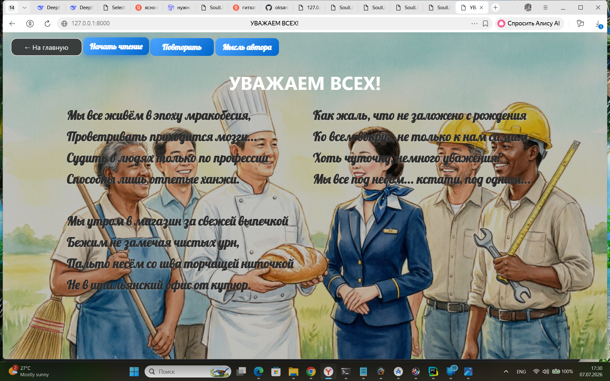
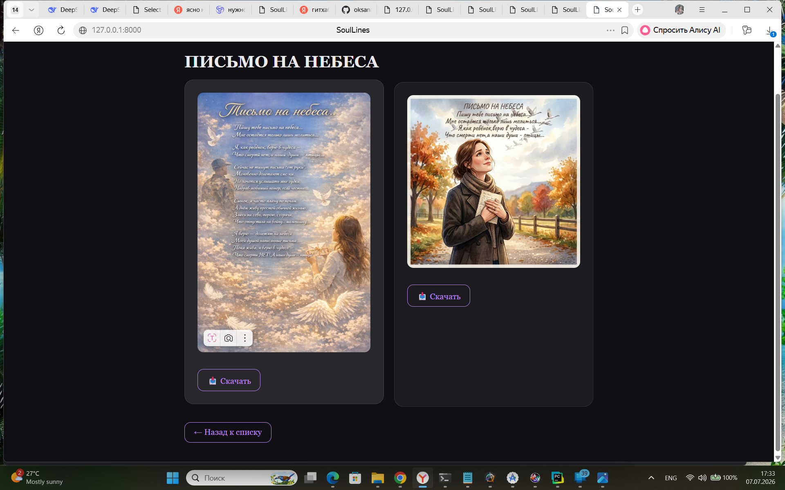
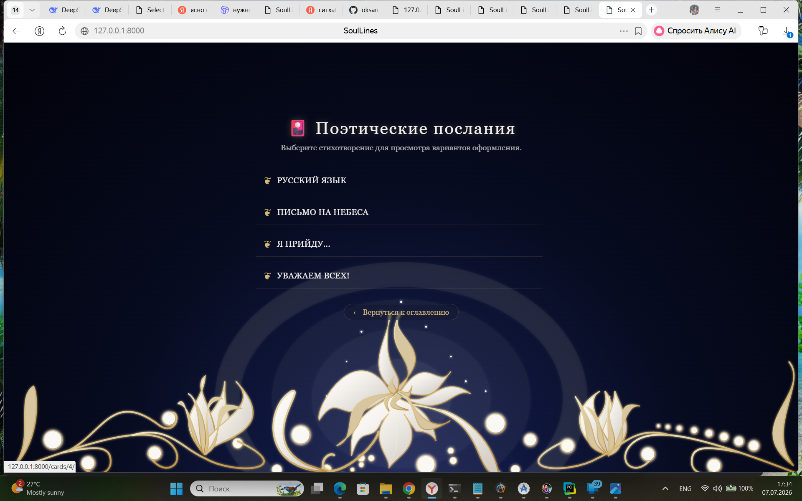

# 🌿 SoulLines

Интерактивное поэтическое пространство, где стихи оживают через атмосферу, звук и визуальные эффекты.

## ✨ Возможности проекта

🌿 Атмосферная главная страница  
📖 Интерактивное чтение стихотворений  
🎵 Аудиосопровождение произведений  
👤 Личный кабинет пользователя  
🎴 Поэтические открытки  
✨ Анимации и визуальное оформление

## 🛠 Технологии

- Python
- Django
- HTML
- CSS
- JavaScript
- SQLite

## 🌙 Галерея проекта

### Главная страница

### Личный кабинет

### Стихотворение

### Карточки

### Поэтические карточки

##📚 Моя библиотека
Место, где хранятся ваши созданные произведения. Здесь можно возвращаться к своим стихам, любоваться ими и сохранять моменты вдохновения.

##✍️ Мастерская
Пространство творчества: пользователь вводит свой текст, выбирает стиль печати и создаёт живое стихотворение с атмосферным оформлением. Готовое произведение можно сохранить в виде поэтической карточки.

##🌊 Место Силы
Виртуальное пространство вдохновения и отдыха. Прогулка у моря под шум прибоя, спокойные пейзажи и короткие поэтические послания помогают отвлечься и найти новые идеи.

## Демонстрация проекта 🎬

Полные видео демонстрации:

- [⬇️ Скачать демонстрацию главной страницы SoulLines](https://github.com/oksanaruban44-dev/SoulLines/raw/main/videos/SoulLines_home.mp4)

- [⬇️ Скачать демонстрацию стихотворения с озвучкой SoulLines](https://github.com/oksanaruban44-dev/SoulLines/raw/main/videos/SoulLines_poem.mp4)